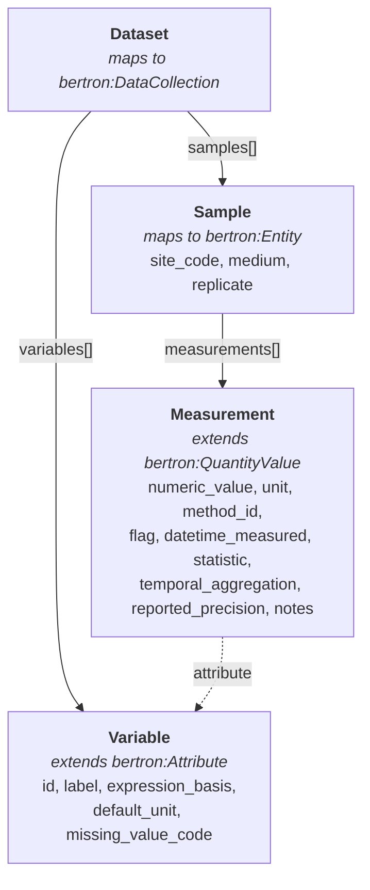
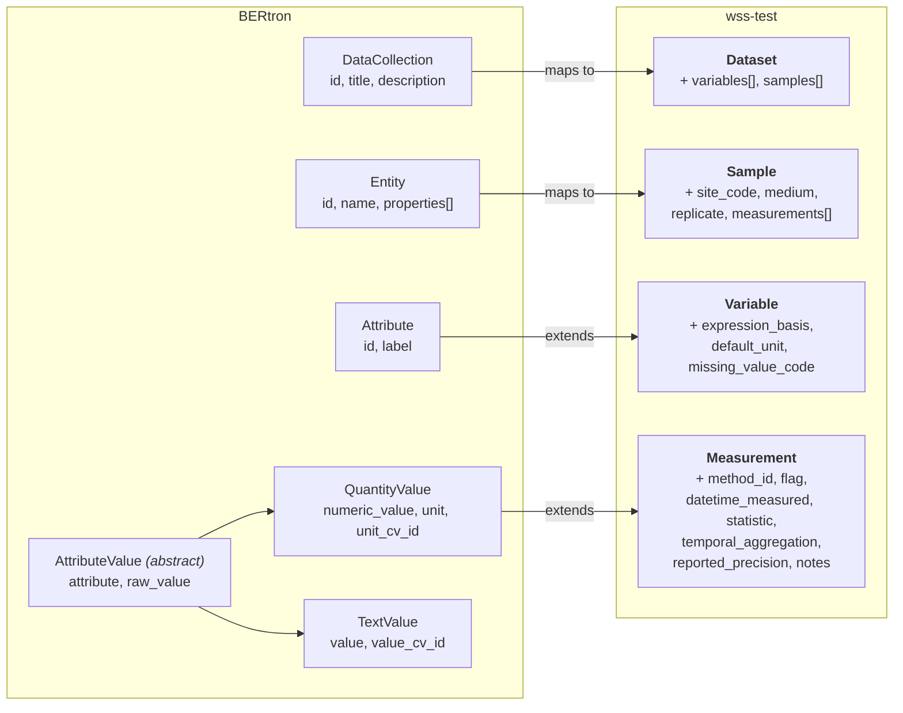

# Water Sample Schema (wss-test)

A [LinkML](https://linkml.io/) schema for structured water sample measurement data.
Built on the [BERtron](https://github.com/ber-data/bertron-schema) common data model,
wss-test adds measurement provenance, variable semantics, and QC metadata to BERtron's
base `Attribute` and `QuantityValue` types.

## What it does

The schema captures environmental water quality measurements in a validated, structured
format — replacing flat spreadsheets with a model that separates **what** was measured
from **how** and **when** it was measured.

### Data Flow

How data is organized at runtime — Dataset contains Variables and Samples,
Samples contain Measurements, each Measurement references a Variable.



### BERtron Mappings

How each wss-test class maps to or extends a BERtron base type.



- **Dataset** (maps to `bertron:DataCollection`) — top-level container, adding
  `variables[]` and `samples[]`
- **Variable** (extends `bertron:Attribute`) — semantic definition of the analyte.
  Inherits `label` from Attribute to name the measured substance; adds
  expression basis, default unit, and missing value sentinel
- **Measurement** (extends `bertron:QuantityValue`) — a single observed value with
  method, QC flag, timestamp, statistic, temporal aggregation, precision, and notes
- **Sample** (maps to `bertron:Entity`) — site code, medium, replicate, and a list of measurements

## Key design choice

A variable like "dissolved oxygen" is defined **once**. Two analytical methods on the
same sample are distinguished by `method_id` on each Measurement, not by duplicating
variable definitions.

## Quick links

| Resource | Description |
|----------|-------------|
| [Schema documentation](elements/index.md) | Auto-generated class, slot, type, and enum reference |
| [Examples](examples.md) | Annotated example data showing common measurement patterns |
| [Artifacts](artifacts.md) | Downloadable JSON Schema, Excel template, SQL DDL, and Python models |
| [About](about.md) | Design rationale, tech stack, and development guide |

## Getting started

```bash
# Install dependencies
just install

# Run the test suite
just test

# Build and serve docs locally
just testdoc
```

## Technology

- [LinkML](https://linkml.io/) for schema definition
- [MkDocs](https://www.mkdocs.org/) with [Material theme](https://squidfunk.github.io/mkdocs-material/) for documentation
- [BERtron](https://github.com/ber-data/bertron-schema) common data model as the base layer
