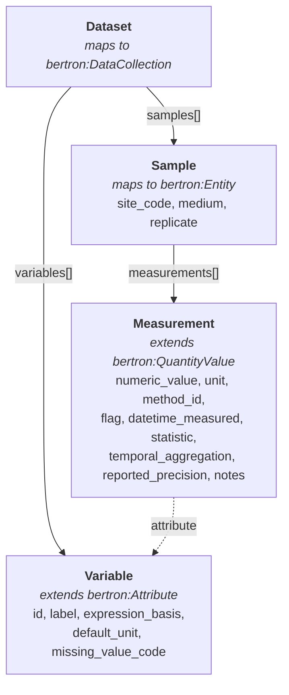
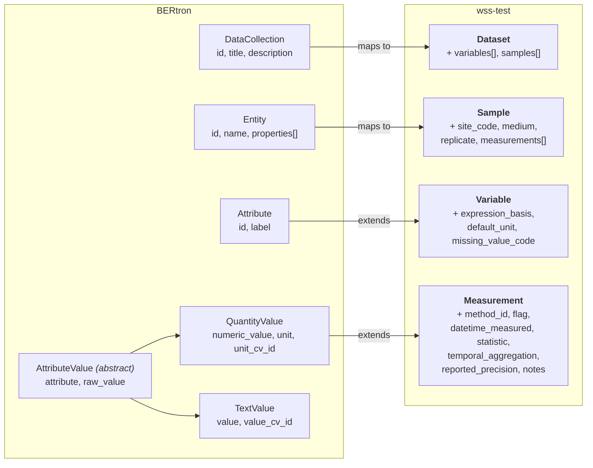

# Mapping to BERtron

This page documents how each element in the wss-test schema maps to the
[BERtron common data model](https://github.com/ber-data/bertron-schema).
BERtron provides the foundational types (`DataCollection`, `Entity`, `Attribute`,
`AttributeValue`, `QuantityValue`, `TextValue`); wss-test extends them with
environmental measurement provenance and variable semantics.

## Data Flow

How data is organized at runtime — Dataset contains Variables and Samples,
Samples contain Measurements, each Measurement references a Variable.

## BERtron Mappings

How each wss-test class maps to or extends a BERtron base type. Slots
prefixed with **+** are wss-test additions that have no BERtron equivalent.

## Class mappings

| wss-test class | BERtron class | Relationship | Notes |
|----------------|---------------|--------------|-------|
| `Attribute` | `bertron:Attribute` | exact mapping | Mirrored locally with `mappings: [bertron:Attribute]` |
| `AttributeValue` | `bertron:AttributeValue` | exact mapping | Abstract base for all value types |
| `QuantityValue` | `bertron:QuantityValue` | exact mapping | Numeric value with unit; is_a `AttributeValue` |
| `TextValue` | `bertron:TextValue` | exact mapping | Text value with optional CV term; is_a `AttributeValue` |
| `Variable` | `bertron:Attribute` | extension | is_a `Attribute`; inherits `id` and `label`; adds expression_basis, default_unit, missing_value_code |
| `Measurement` | `bertron:QuantityValue` | extension | is_a `QuantityValue`; adds method_id, flag, datetime_measured, statistic, temporal_aggregation, reported_precision, notes |
| `Dataset` | `bertron:DataCollection` | mapping | Maps to DataCollection (`id`, `title`, `description`); adds `variables[]` and `samples[]` |
| `Sample` | `bertron:Entity` | mapping | Maps to Entity (`id`, `name`, `properties[]`); replaces generic properties with typed `site_code`, `medium`, `replicate`, `measurements[]` |

## Slot mappings

### Slots inherited from BERtron

These slots map directly to BERtron and carry the same semantics.

| wss-test slot | BERtron slot | Defined on | Range | Description |
|---------------|--------------|------------|-------|-------------|
| `attribute` | `bertron:attribute` | AttributeValue | Attribute | The attribute being represented |
| `raw_value` | `bertron:raw_value` | AttributeValue | string | Un-normalized atomic value as a string |
| `numeric_value` | `bertron:numeric_value` | QuantityValue | float | The numerical part of a quantity |
| `unit` | `bertron:unit` | QuantityValue | string | Unit of measurement |
| `unit_cv_id` | `bertron:unit_cv_id` | QuantityValue | curie | Unit expressed as a CURIE from the Unit Ontology |
| `value` | `bertron:value` | TextValue | string | The value as a text string |
| `value_cv_id` | `bertron:value_cv_id` | TextValue | curie | Controlled vocabulary ID for the value |

### Slots on Attribute (maps to bertron:Attribute)

These slots are inherited by `Variable` (which is_a `Attribute`). In particular,
`label` serves as the human-readable name for each Variable (e.g. "dissolved organic carbon").

| wss-test slot | BERtron slot | Range | Description |
|---------------|--------------|-------|-------------|
| `id` | *(same concept)* | string | Unique identifier |
| `label` | *(same concept)* | string | Human-readable name for the attribute or variable (e.g. "dissolved organic carbon") |

### wss-test extension slots on Variable

These slots are added by wss-test and have **no BERtron equivalent**.

| Slot | Range | Description |
|------|-------|-------------|
| `expression_basis` | string | Chemical expression basis (e.g. as dissolved carbon) |
| `default_unit` | string | Default unit for this variable |
| `missing_value_code` | integer | Sentinel value used to represent missing data |

### wss-test extension slots on Measurement

These slots are added by wss-test and have **no BERtron equivalent**.

| Slot | Range | Description |
|------|-------|-------------|
| `method_id` | string | Identifier for the analytical method |
| `flag` | string | Quality assurance flag |
| `datetime_measured` | datetime | Date and time the measurement was taken |
| `statistic` | string | Summary statistic applied (e.g. mean, median) |
| `temporal_aggregation` | string | Time interval over which the statistic was aggregated (e.g. daily, 15-min) |
| `reported_precision` | float | Precision of the reported result value |
| `notes` | string | Free-text notes about the measurement |

### Domain container slots

These slots exist on `Dataset` (maps to `bertron:DataCollection`) and `Sample`
(maps to `bertron:Entity`). The base BERtron classes provide `id`, `name`/`title`,
and `description`; the slots below are wss-test additions.

| Slot | Defined on | Range | Description |
|------|------------|-------|-------------|
| `id` | Dataset, Sample | string | Unique identifier |
| `name` | Dataset, Sample | string | Human-readable name |
| `description` | Dataset | string | Free-text description |
| `variables` | Dataset | Variable[] | Variable definitions used by measurements |
| `samples` | Dataset | Sample[] | Samples included in this dataset |
| `site_code` | Sample | string | Code identifying the sampling site |
| `medium` | Sample | string | Environmental medium sampled (e.g. OCN) |
| `replicate` | Sample | integer | Replicate number within a site and medium |
| `measurements` | Sample | Measurement[] | Measurements performed on this sample |

## Design rationale

wss-test mirrors BERtron types locally (with `mappings:` annotations) rather
than importing them directly. This keeps the schema self-contained while
preserving semantic interoperability through explicit mappings. Any tool that
understands BERtron can follow the mapping annotations to align wss-test data
with the broader BERtron ecosystem.

The extension pattern — `Variable is_a Attribute` and `Measurement is_a
QuantityValue` — means that every wss-test Variable is a valid BERtron
Attribute and every Measurement is a valid BERtron QuantityValue. Similarly,
`Dataset` maps to `DataCollection` and `Sample` maps to `Entity`, providing
BERtron-compatible containers for the data. Downstream consumers that only
understand BERtron can safely ignore the additional wss-test slots.
