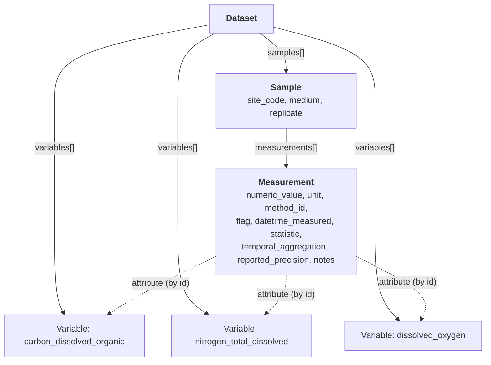

# Examples

This page demonstrates how the wss-test schema represents water sample measurement data.
The example dataset in `tests/data/valid/Dataset-001.yaml` contains real-world patterns
including multiple analytes, replicate samples, dual methods, QC flags, and missing values.

## Download Example Data

| Dataset | Download |
|---|---|
| Water Sample Analytical Results | [`Dataset-001.yaml`](examples/Dataset-001.yaml) |

## The Flat Spreadsheet View

Users submit data in a flat tabular format like this:

| result_value | flag | datetime_measured | sample_name | method_id | measured_variable | unit | unit_basis | statistic | temporal_aggregation | missing_value_code | reported_precision | notes |
|---|---|---|---|---|---|---|---|---|---|---|---|---|
| 1.68 | N/A | N/A | CM_003_OCN-1 | NPOC_T_005 | carbon_dissolved_organic | milligrams per liter | as dissolved carbon | N/A | N/A | -9999 | 0.01 | N/A |
| -9999 | VB_001 | N/A | CM_004_OCN-1 | NPOC_T_005 | carbon_dissolved_organic | milligrams per liter | as dissolved carbon | N/A | N/A | -9999 | 0.01 | N/A |
| 2.43 | N/A | 2016-03-10 13:45 | CM_005_OCN-1 | DO_1 | dissolved_oxygen | milligrams per liter | as dissolved oxygen | N/A | N/A | -9999 | 0.01 | N/A |
| 2.4 | N/A | 2016-03-10 13:45 | CM_005_OCN-1 | DO_2 | dissolved_oxygen | milligrams per liter | as dissolved oxygen | mean | 15-min | -9999 | 0.01 | N/A |
| 2.37 | N/A | 2016-03-10 13:45 | CM_005_OCN-5 | DO_1 | dissolved_oxygen | milligrams per liter | as dissolved oxygen | N/A | N/A | -9999 | 0.01 | calibration suspect |

The wss-test schema captures this same data in a structured, validated form.

## How the Schema Maps to the Spreadsheet

Every column in the spreadsheet maps to a slot in the schema:

| Spreadsheet Column | Schema Slot | Lives On |
|---|---|---|
| `result_value` | `numeric_value` (alias: `result_value`) | `Measurement` |
| `flag` | `flag` | `Measurement` |
| `datetime_measured` | `datetime_measured` | `Measurement` |
| `sample_name` | `id` / `name` | `Sample` |
| `method_id` | `method_id` | `Measurement` |
| `measured_variable` | `id` | `Variable` (referenced via `attribute`) |
| `unit` | `unit` | `Measurement` |
| `unit_basis` | `expression_basis` | `Variable` |
| `statistic` | `statistic` | `Measurement` |
| `temporal_aggregation` | `temporal_aggregation` | `Measurement` |
| `missing_value_code` | `missing_value_code` | `Variable` |
| `reported_precision` | `reported_precision` | `Measurement` |
| `notes` | `notes` | `Measurement` |

## Schema Structure

The data is organized into three levels:



## Variable Definitions

Variables are defined once in the `variables` list and referenced by every measurement.
The `label` slot is inherited from `bertron:Attribute` and names the measured substance.
This eliminates duplication — "dissolved oxygen" is defined once regardless of how many
methods measure it.

```yaml
variables:
  - id: carbon_dissolved_organic
    label: dissolved organic carbon
    expression_basis: as dissolved carbon
    default_unit: UO:0000175        # mg/L
    missing_value_code: -9999

  - id: nitrogen_total_dissolved
    label: total dissolved nitrogen
    expression_basis: as dissolved nitrogen
    default_unit: UO:0000175
    missing_value_code: -9999

  - id: dissolved_oxygen
    label: dissolved oxygen
    expression_basis: as dissolved oxygen
    default_unit: UO:0000175
    missing_value_code: -9999
```

## Pattern: Basic Measurements (DOC + TDN)

Sites CM_003 and CM_004 show the simplest pattern — one method per variable, three
replicates per site:

```yaml
- id: CM_003_OCN-1
  site_code: CM_003
  medium: OCN
  replicate: 1
  measurements:
    - attribute: carbon_dissolved_organic
      numeric_value: 1.68
      unit: UO:0000175
      method_id: NPOC_T_005
      reported_precision: 0.01
    - attribute: nitrogen_total_dissolved
      numeric_value: 0.44
      unit: UO:0000175
      method_id: NPOC_T_005
      statistic: mean
      temporal_aggregation: daily
      reported_precision: 0.01
```

## Pattern: Missing Values and QC Flags

When a measurement fails QC, the sentinel value goes in `numeric_value` and a `flag`
records the reason. The `missing_value_code` on the Variable tells consumers what
sentinel to expect:

```yaml
- id: CM_004_OCN-1
  site_code: CM_004
  medium: OCN
  replicate: 1
  measurements:
    - attribute: carbon_dissolved_organic
      numeric_value: -9999           # sentinel for missing
      unit: UO:0000175
      method_id: NPOC_T_005
      flag: VB_001                   # QC flag explaining why
```

## Pattern: Two Methods, Same Variable

Site CM_005 shows the key design advantage — dissolved oxygen is measured by two
different methods (DO_1 and DO_2) on the same sample. Both reference the same
Variable (`dissolved_oxygen`), distinguished only by `method_id`:

```yaml
- id: CM_005_OCN-1
  site_code: CM_005
  medium: OCN
  replicate: 1
  measurements:
    # Method 1: instantaneous reading
    - attribute: dissolved_oxygen
      numeric_value: 2.43
      unit: UO:0000175
      method_id: DO_1
      datetime_measured: "2016-03-10T13:45:00Z"
      reported_precision: 0.01

    # Method 2: 15-minute mean
    - attribute: dissolved_oxygen
      numeric_value: 2.4
      unit: UO:0000175
      method_id: DO_2
      statistic: mean
      temporal_aggregation: 15-min
      datetime_measured: "2016-03-10T13:45:00Z"
      reported_precision: 0.01
```

This replaces the old approach of creating separate `MeasurementSpecification` entries
(DO-via-DO_1, DO-via-DO_2) — 3 Variables instead of 5 MeasurementSpecifications.

## Pattern: Free-Text Notes

Any measurement can carry free-text `notes` for additional context:

```yaml
    - attribute: dissolved_oxygen
      numeric_value: 2.37
      unit: UO:0000175
      method_id: DO_1
      datetime_measured: "2016-03-10T13:45:00Z"
      reported_precision: 0.01
      notes: calibration suspect
```

## Full Dataset Summary

The example dataset (`Dataset-001.yaml`) contains:

| | Count |
|---|---|
| Variables defined | 3 (DOC, TDN, DO) |
| Samples | 12 (3 sites x 1-6 replicates) |
| Total measurements | 30 |
| Analytical methods | 4 (NPOC_T_005, DO_1, DO_1A, DO_2) |
| QC-flagged measurements | 1 (VB_001 on CM_004_OCN-1 DOC) |
| Measurements with timestamps | 18 (all CM_005 samples) |
| Measurements with notes | 3 (calibration suspect on CM_005_OCN-5) |

## What This Buys You

1. **Every slot traces to BERtron or is explicitly new** — no ambiguity about what is inherited vs. added
2. **Variable = Attribute + domain semantics** — `label` is inherited from `bertron:Attribute`; domain consumers additionally get expression_basis
3. **Measurement = QuantityValue + provenance** — BERtron consumers see a valid QuantityValue; domain consumers get method, QC, timestamps
4. **Two DO methods on CM_005 are distinguishable** — same attribute (`dissolved_oxygen`), different `method_id`
5. **3 Variables instead of 5 MeasurementSpecifications** — no more duplicating variable definitions per method
